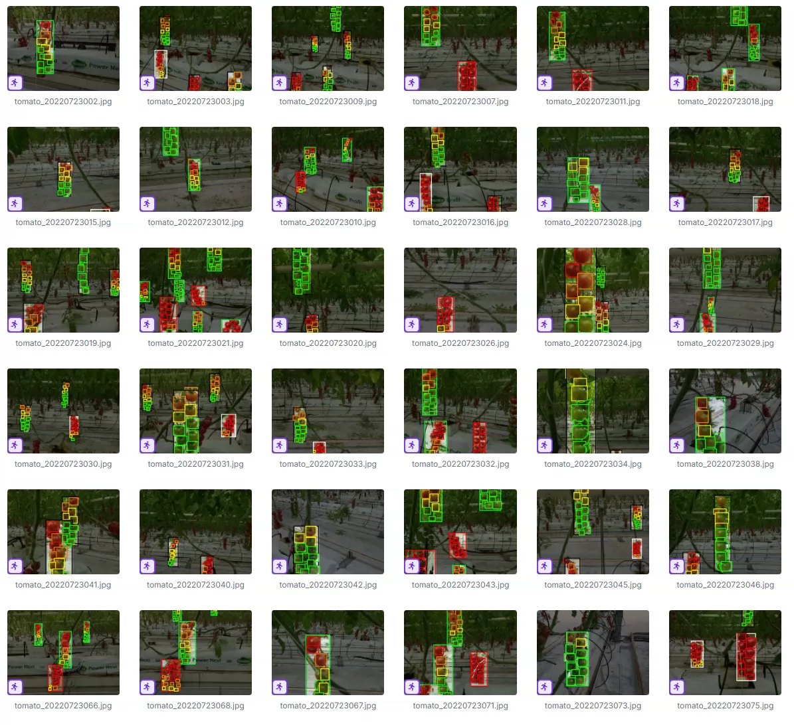
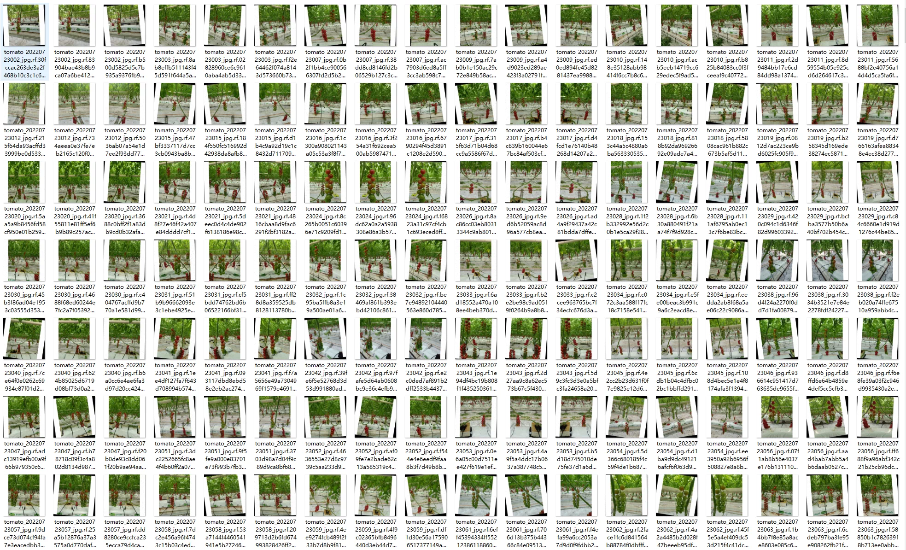
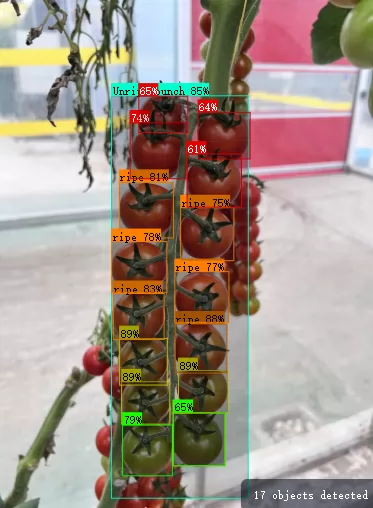
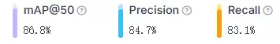
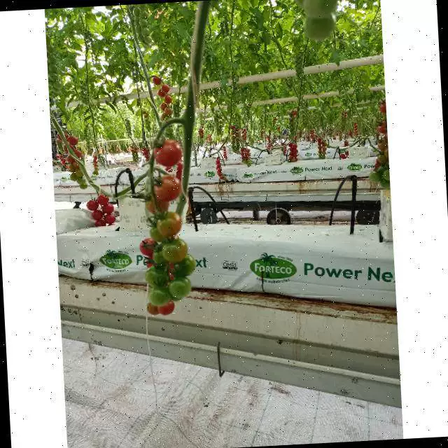
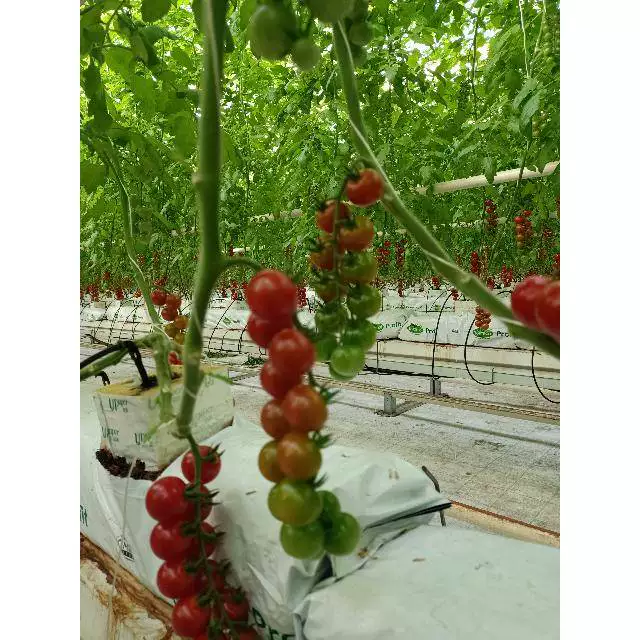
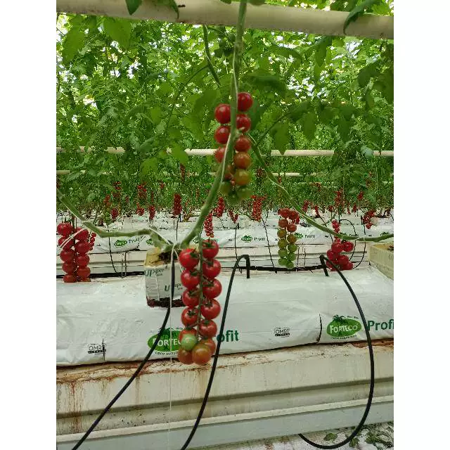

## Body

（Agricultural Product）Pomegranate Dataset for Ripeness Target Detection in YOLO Format

Totally 2633 images, each labeled with YOLO format. The training set (2247), test set (127), and validation set (259) are divided accordingly.

The dataset is divided into 6 categories: 'Ripe bunch', 'Unripe bunch', 'fully ripe', 'green', 'ripe', 'turning'. These categories represent 'A ripe bunch of grapes', 'An unripe bunch of grapes', 'Fully ripe', 'Green', 'Ripened', 'Turning'.

Electronic virtual products sold are not returnable.

## Images

Here is a pay link on Stripe ( https://buy.stripe.com/3cs8yP7sY87d0vu9AB ). Please contact me lonlonago@foxmail.com after funding $89, and I will send you a complete data files , thank you!

